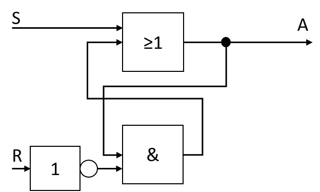
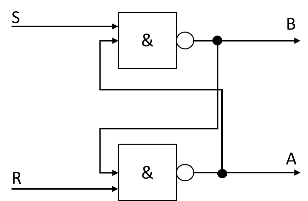

_Übungsaufgabe zur Veranstaltung [IT Systeme](https://hsro-wif-oop.github.io) im [Bachelorstudiengang Wirtschaftsinformatik](https://www.th-rosenheim.de/technik/informatik-mathematik/wirtschaftsinformatik-bachelor/) an der [Hochschule Rosenheim](http://www.th-rosenheim.de)._


# 03 - Prozessorarchitektur

In dieser Übung werden wir uns weiter ein wenig mit Schaltnetzwerken beschäftigen.

**Die Lösung befindet sich im Branch Musterloesung.**


## Aufgabe 1: Alarmanlage

Alarmanlagen sind heutzutage allseits bekannt und werden auch im Privaten sehr häufig eingesetzt. Ziel soll es im Folgenden sein, eine Schaltung einer einfachen Alarmanlage zu entwickeln:
- Durch das Auslösen eines Sensors (s) (bspw. an Fenstern, Haustüren etc.) soll eine Alarm-Sirene (A) aktiviert werden, die erst durch ein manuelles Rücksetzen (r) wieder verstummt. 

### a)

Entwickeln Sie mit einem ODER-Gatter eine „Selbsterhalte“-Schaltung, die beim Auslösen eines Sensors (s) den Ausgang A dauerhaft auf 1 setzt, auch wenn s wieder deaktiviert wird.

>Note: Bei einer „Selbsterhalte“-Schaltung wird das Ausgangssignal eines Gatters nicht nur als Signal für den Ausgang verwendet, sondern auch durch eine zusätzliche Kabel-Abzweigung zurückgeführt und als Eingang für ein Gatter verwendet (Hier mit einem Oder-Gatter). 

**Lösung:**
Um das Eingangssignal dauerhaft zu setzen, also auch dann den Alarm aktiviert zu lassen, wenn bspw. der Sensor s nicht mehr ausgelöst wird (z.B. weil die Haustür nach dem Öffnen wieder geschlossen wurde), wird der aktuelle Ausgang A zurückgeführt und als Eingang für ein Gatter verwendet. 


### b)

Ergänzen Sie die Schaltung um eine Möglichkeit, die Alarmanlage zurückzusetzen (r für Rücksetzen). Füllen Sie dazu zunächst die Wahrheitstabelle aus (den Zustand r=1 und s=1 betrachten wir später gesondert): 

| r |  s | A |
|---|----|-------|
| 0 |  0 |   Aalt   |
| 0 | 1 |  1   |
| 1 | 0 |  0   |
| 1 | 1  | nd     |

>Note: Nutzen Sie den Ausgang des ODER-Gatters als Eingang in ein neues UND-Gatter. Der Ausgang des UND-Gatters wird zum 2. Eingang des ODER-Gatters geführt. Jetzt muss nur noch der Schalter Rücksetzen richtig angeschlossen werden.

**Lösung:**

Zum Rücksetzen werden zusätzlich ein NOT- und ein UND-Gatter benötigt.



### c)

Konzipieren Sie eine Alarmanlage mit Setzen (s) und Rücksetzen (r) nur aus NAND-Gattern. 

>Note: Ein NICHT-Gatter kann mit einem NAND-Gatter erzeugt werden, indem man beide Eingänge mit dem gleichen Eingangssignal verbindet.
Behalte weiter die sich "kreuzende Leitungsstruktur" bei, ersetze die bisherigen Gatter mit NAND-Gatter, ... 

**Lösung:**




## Aufgabe 2: Zahlenkomparator für Dualzahlen

Eine digitale Schaltung, mit der zwei Dualzahlen auf Gleichheit oder Ungleichheit geprüft werden, wird als Zahlenkomparator bezeichnet.

In der Aufgabe soll eine Schaltung entwickelt werden, die in der Lage ist, zwei Dualzahlen P (P1 und P2) und Q (Q1 und Q2) mit je zwei Bits zu vergleichen. Im Falle der Ungleichheit soll noch ein Größer -kleiner- Vergleich erfolgen. 

### a) Ergänze die Wahrheitstabelle. 
### b) Stellen Sie die drei Funktionsgleichungen Y1, Y2 und Y3 auf und minimieren diese.  
### c) Skizziere die Schaltung aus Grundgliedern

**Lösung:**


| P1 |  P2 | Q1   |Q2    |Y1 (P>Q) |Y2 (P=Q) |Y3 (P<Q) |
|----|-----|------|------|----|----|----|
|  0 |  0  |   0  | 0  | 0| 1| 0|
|  0 |  0  |   0  | 1  | 0| 0| 1|
|  0 |  0  |   1  | 0  | 0| 0| 1|
|  0 |  0  |   1  | 1  | 0| 0| 1|
|  0 |  1  |   0  | 0  | 1| 0| 0|
|  0 |  1  |   0  | 1  | 0| 1| 0|
|  0 |  1  |   1  | 0  | 0| 0| 1|
|  0 |  1  |   1  | 1  | 0| 0| 1|
|  1 |  0  |   0  | 0  | 1| 0| 0|
|  1 |  0  |   0  | 1  | 1| 0| 0|
|  1 |  0  |   1  | 0  | 0| 1| 0|
|  1 |  0  |   1  | 1  | 0| 0| 1|
|  1 |  1  |   0  | 0  | 1| 0| 0|
|  1 |  1  |   0  | 1  | 1| 0| 0|
|  1 |  1  |   1  | 0  | 1| 0| 0|
|  1 |  1  |   1  | 1  | 0| 1| 0|

(¬e1 v ¬e2 v e3) = ¬(e1 ∧ e2 ∧ ¬e3)
Y1= (P2 ∧ ¬Q2) v (¬Q1 ∧ P1 ∧ P2) v (¬Q1 ∧ ¬Q2 ∧ P1)  
Y2= (Q1 ∧ Q2 ∧ P1 ∧ P2) v (¬Q1 ∧ Q2 ∧ ¬P1 ∧ P2) v (Q1 ∧ ¬Q2 ∧ P1 ∧ ¬P2) v (¬Q1 ∧ ¬Q2 ∧ ¬P1 ∧ ¬P2)  
Y3= (Q2 ∧ ¬P2) v (Q1 ∧ Q2 ∧ ¬P1) v (Q1 ∧ ¬P1 ∧ ¬P2)  

## Aufgabe 3: Flip-Flop in Java

Schreiben Sie eine Klasse *FlipFlop*, die eine Flip-Flop Schlatung simuliert. Diese soll das Interface *Latch* implementieren:

```java
public interface Latch {
    // simulates setting S and R of a latch
    void set(boolean S, boolean R);
    // returns the A value
    boolean getA();
    // returns the B value
    boolean getB();
}
```

Hierzu benötigt man kein grosses Projekt in IntelliJ, sondern eine einzelne Klasse sollte reichen, sowie eine Datei für das `Latch`-Interface.

**Main-Methode nicht vergessen!**

In der main()-Methode können die einzelnen Fälle abgedeckt werden.

**Lösung**:

```java
public class FlipFlop implements Latch {

    private boolean A,B;

    public FlipFlop() {
        this.A = false;
        this.B = false;
    }

    @Override
        // simulates setting S and R of a latch
    public void set(boolean S, boolean R) {
        if (S && R)
            throw new IllegalArgumentException("S and R are 1, this is not allowed!");

        this.A = !(R || this.B);
        this.B = !(S || this.A);
    }

    @Override
    public boolean getA() {
        return this.A;
    }

    @Override
    public boolean getB() {
        return this.B;
    }

    public static void main(String[] args) {
        Latch f = new FlipFlop();
        f.set(true, false);
        System.out.println(f.getA());
        System.out.println(f.getB());
        f.set(false, true);
        System.out.println(f.getA());
        System.out.println(f.getB());
        f.set(false, false);
        System.out.println(f.getA());
        System.out.println(f.getB());
        f.set(true, false);
        System.out.println(f.getA());
        System.out.println(f.getB());
        f.set(true, false);
        System.out.println(f.getA());
        System.out.println(f.getB());
        try {
            f.set(true, true);
        } catch (IllegalArgumentException ex) {
            System.out.println(ex.getMessage());
        }
    }
}
```

### b)

Erinnern Sie sich and `FunctionalInterfaces`?

Gegeben ist folgendes Interface:

```java
public interface Logic {
    //
    boolean operate(boolean in1, boolean in2);
}
```

Schreiben Sie eine Klasse `Gate`, die eine Methode `public static boolean proc(boolean in1, boolean in2, Logic l)` hat. Diese Methode führt die `FunctionalInterface` Methode `operate` aus und gibt die Liste der Wahrheitswerte zurück.

Folgende `main()` Methode sollte laufen:

```java
public class Gate {
    // 
    
    public static void main(String[] args) {
    System.out.println(Gate.proc(false,false, (i1,i2) -> i1 || i2));
    System.out.println(Gate.proc(true,false, (i1,i2) -> i1 || i2));
    System.out.println(Gate.proc(false,true, (i1,i2) -> i1 || i2));
    System.out.println(Gate.proc(true,true, (i1,i2) -> i1 || i2));

    System.out.println(Gate.proc(false,false, (i1,i2) -> i1 && i2));
    System.out.println(Gate.proc(true,false, (i1,i2) -> i1 && i2));
    System.out.println(Gate.proc(false,true, (i1,i2) -> i1 && i2));
    System.out.println(Gate.proc(true,true, (i1,i2) -> i1 && i2));
    }
}
```

Produziert:
```
false
true
true
true
false
false
false
true
```
**Erweitern Sie die Lambda-Ausdrücke um NOR, NAND und XOR Funktionen!**

**Lösung**:

```
public class Gate {

    public static boolean proc(boolean in1, boolean in2, Logic l) {
        return l.operate(in1, in2);
    }

    public static void main(String[] args) {
        System.out.println(Gate.proc(false,false, (i1,i2) -> i1 || i2));
        System.out.println(Gate.proc(true,false, (i1,i2) -> i1 || i2));
        System.out.println(Gate.proc(false,true, (i1,i2) -> i1 || i2));
        System.out.println(Gate.proc(true,true, (i1,i2) -> i1 || i2));

        System.out.println(Gate.proc(false,false, (i1,i2) -> i1 && i2));
        System.out.println(Gate.proc(true,false, (i1,i2) -> i1 && i2));
        System.out.println(Gate.proc(false,true, (i1,i2) -> i1 && i2));
        System.out.println(Gate.proc(true,true, (i1,i2) -> i1 && i2));

        // NOR
        System.out.println(Gate.proc(false,false, (i1,i2) -> !(i1 || i2)));
        System.out.println(Gate.proc(true,false, (i1,i2) -> !(i1 || i2)));
        System.out.println(Gate.proc(false,true, (i1,i2) -> !(i1 || i2)));
        System.out.println(Gate.proc(true,true, (i1,i2) -> !(i1 || i2)));

        // NAND
        System.out.println(Gate.proc(false,false, (i1,i2) -> !(i1 && i2)));
        System.out.println(Gate.proc(true,false, (i1,i2) -> !(i1 && i2)));
        System.out.println(Gate.proc(false,true, (i1,i2) -> !(i1 && i2)));
        System.out.println(Gate.proc(true,true, (i1,i2) -> !(i1 && i2)));

        //XOR
        System.out.println(Gate.proc(false,false, (i1,i2) -> (i1 || i2) && !(i1 && i2)));
        System.out.println(Gate.proc(true,false, (i1,i2) -> (i1 || i2) && !(i1 && i2)));
        System.out.println(Gate.proc(false,true, (i1,i2) -> (i1 || i2) && !(i1 && i2)));
        System.out.println(Gate.proc(true,true, (i1,i2) -> (i1 || i2) && !(i1 && i2)));

    }
}
```